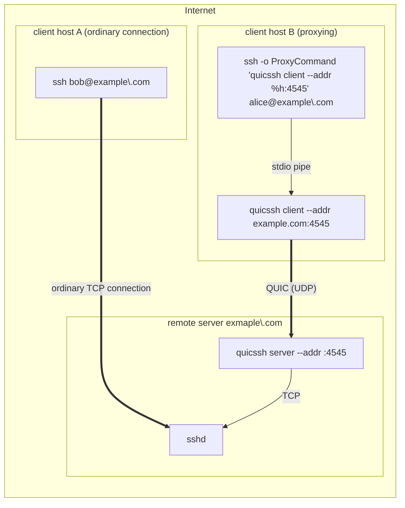

# quicssh

> :smile: **quicssh** is a QUIC proxy that allows to use QUIC to connect to an SSH server without needing to patch the client or the server.

[](https://circleci.com/gh/moul/quicssh)
[](https://godoc.org/moul.io/quicssh)
[](https://github.com/moul/quicssh/blob/master/LICENSE)
[](https://github.com/moul/quicssh/releases)
[](https://goreportcard.com/report/moul.io/quicssh)
[](https://microbadger.com/images/moul/quicssh)
[](https://manfred.life/)

## Architecture



## Usage

### Modes

```console
$ quicssh -h
NAME:
   quicssh - Client and server parts to proxy SSH (TCP) over UDP using QUIC transport

USAGE:
   quicssh [global options] command [command options]

VERSION:
   v0.0.0-20230730133128-1c771b69d1a7+dirty

COMMANDS:
   server
   client
   help, h  Shows a list of commands or help for one command

GLOBAL OPTIONS:
   --help, -h     show help
   --version, -v  print the version
```

### Client mode

```console
$ quicssh client -h
NAME:
   quicssh client

USAGE:
   quicssh client [command options]

OPTIONS:
   --addr value       address of server (default: "localhost:4242")
   --localaddr value  source address of UDP packets (default: ":0")
   --help, -h         show help
```

### Server mode

```console
$ quicssh server -h
NAME:
   quicssh server

USAGE:
   quicssh server [command options]

OPTIONS:
   --bind value         bind address (default: "localhost:4242")
   --sshdaddr value     target address of sshd (default: "localhost:22")
   --idletimeout value  exit on idle interval (10s, 2m, 1h) (default: "0s")
   --help, -h           show help
```

## Install

### Original

```console
$ go get -u moul.io/quicssh
```

### Install this fork

```console
# go install github.com/michurin/quicssh@server_idle_exit # won't work, you are to build and intall binnary manually
cd tmp # somewhere
git clone https://github.com/michurin/quicssh --branch server_idle_exit --single-branch quicssh-tmp
cd quicssh-tmp
go build .
mv quicssh ~/go/bin # some dir from $PATH
```

## Resources

- https://korben.info/booster-ssh-quic-quicssh.html

[](https://star-history.com/#moul/quicssh&Date)

## License

© 2019-2023 [Manfred Touron](https://manfred.life) -
[Apache-2.0 License](https://github.com/moul/quicssh/blob/master/LICENSE)
